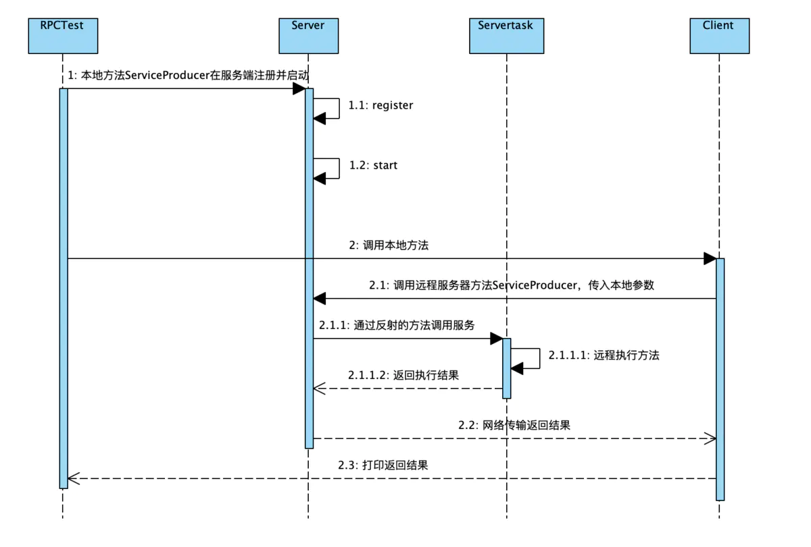
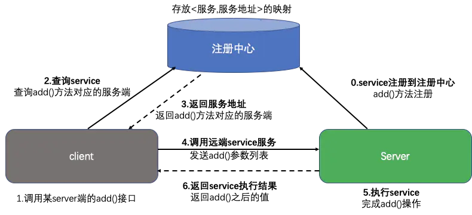

### 记录

### 已完成部分

### 未完成部分 --- 优先级降序
* 放到虚拟机上可以发送过去但无法返回，无法执行任务，什么情况？---【已解决】 时间不一致
* 调度算法没有添加
* cron定时任务
* 网页展示支持
* ppt

##### 答辩思路
* 主要介绍的是调度策略和负载均衡策略
* 测试准备，3台虚拟机和本机构成内网，时间调整一致，虚拟机用来代替服务器，需要配置相关应用。
* 向系统注册我的三台服务器(如果没有前端则直接写库)
* 设计一个任务，指定执行脚本，指定调度策略，指定目标服务器(如果没有则走默认的)
* 方法执行。先获取指定服务器列表，根据指定的策略进行计算，获取目标服务器，发送rpc(远程过程调用)，
将想要目标机器上执行的脚本发送过去，再通过服务器上的应用，执行这个脚本。测试写了个简单的mkdir创建文件夹
也可以用他去启动其他某个程序等等，目前只支持shell脚本。
* 简单来说过程就是这样，那么我们来测试不同的策略是否真的有效。介绍各种算法。
* 介绍rpc远程过程调用

* 服务端需要暴露端口号和ip地址
* 客户端需要知道并发送方法全路径名，参数类型，参数列表

---------------------------
### 4.1
* 接口测试没有完全完成，调度算法欠缺

---------------------------

### 配置
* sujia1,sujia2,sujia3 启动我的server服务
* 单测